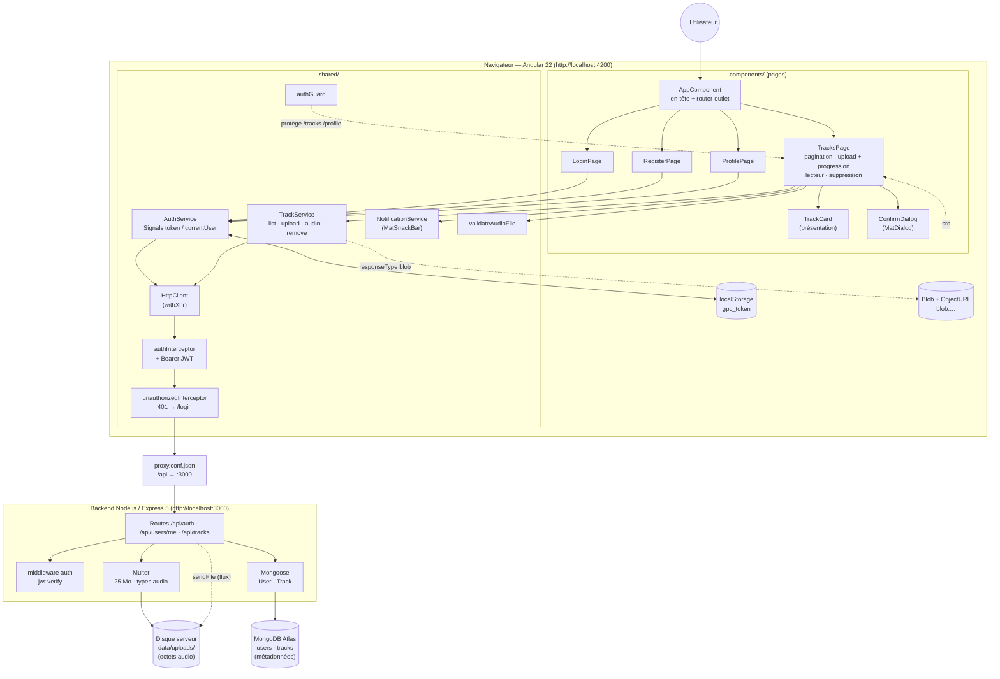

# Guitar Practice Cloud — package étudiant

Ce dépôt contient uniquement les ressources nécessaires aux trois TP :
`backend/` et `frontend-starter/`, ainsi que les sujets et documents utiles.

## Prérequis

- Node.js 22 ou plus récent ;
- un compte MongoDB Atlas pour l'élève ;
- Git et un navigateur récent.
- Un IDE de qualité
- Recommandé : un abonnement à un 

Consulter [ATLAS_SETUP.md](ATLAS_SETUP.md) pour créer la base de données.

## Démarrer le backend

```bash
cd backend
cp .env.example .env
```

Renseigner dans `.env` l’URI MongoDB Atlas et le secret JWT. Ne jamais publier
ce fichier ni copier un secret dans le code Angular.

```bash
npm install
npm start
```

Le backend écoute normalement sur `http://localhost:3000`.

## Démarrer le frontend

Dans un autre terminal :

```bash
cd frontend-starter
npm install
npm start
```

Ouvrir `http://localhost:4200`. Le compte de démonstration est
`demo@example.com` / `Demo1234!`.

## Architecture de l'application

### Vue d'ensemble



> Si votre éditeur n'affiche pas les diagrammes Mermaid, la même image est disponible dans [`docs/architecture.png`](docs/architecture.png).

### Couches et responsabilités

| Couche | Emplacement | Rôle |
|---|---|---|
| Pages (composants) | `frontend-starter/src/app/components/*` | Affichage, formulaires réactifs, état local en Signals. N'appellent **jamais** `HttpClient` directement. `ConfirmDialog` : confirmation avant suppression (Angular Material). |
| Configuration | `frontend-starter/src/app/app.config.ts` | Routes, `HttpClient` avec `withXhr()` (nécessaire à la progression d'upload depuis Angular 22) et intercepteurs. |
| Services | `frontend-starter/src/app/shared/services` | Seuls points d'appel HTTP : `AuthService` (auth, profil, token), `TrackService` (liste paginée, upload multipart avec progression, audio en `Blob`, suppression). `NotificationService` : messages SnackBar. |
| Intercepteurs | `frontend-starter/src/app/shared/interceptors` | `authInterceptor` ajoute `Authorization: Bearer <JWT>` ; `unauthorizedInterceptor` déconnecte et renvoie vers `/login` sur un 401. |
| Garde | `frontend-starter/src/app/shared/guards` | `authGuard` bloque `/tracks` et `/profile` sans token. |
| Modèles, pipes, validateurs, utilitaires | `frontend-starter/src/app/shared/{models,pipes,validators,utils}` | Interfaces TypeScript du contrat, états de l'upload, formatage des tailles, validation audio avant envoi, traduction des événements HTTP de progression, lecture des messages d'erreur HTTP. |
| Tests frontend | `frontend-starter/src/**/*.spec.ts` | Vitest + jsdom, réponses HTTP simulées (`HttpTestingController`) : `npm test`. |
| Proxy de dev | `frontend-starter/proxy.conf.json` | Redirige `/api/*` de `:4200` vers `:3000` (pas de CORS en dev). |
| API | `backend/src/app.js` | Routes Express, middleware `auth` (JWT), Multer (upload sur disque), gestion centralisée des erreurs. |
| Démarrage | `backend/src/server.js` | Connexion MongoDB, création du compte démo, ouverture du port. |
| Données | `backend/src/models` + MongoDB Atlas | `User` (mot de passe haché bcrypt) et `Track` (métadonnées, `ownerId`). Les **octets audio** restent dans `backend/data/uploads/`. |

### Arborescence

```text
.
├── API_CONTRACT.md            ← contrat HTTP (source de vérité front ↔ back)
├── SCHEMA_FLUX_CONNEXION.md   ← flux « Se connecter » (TP1)
├── SCHEMA_FLUX_CONNEXION.drawio ← diagramme de séquence à ouvrir dans draw.io
├── TP2_ANALYSE_AUDIO.md       ← analyse upload / Blob / streaming (TP2)
├── TP3_ANALYSE.md             ← suppression, progression, rapport des tests (TP3)
├── RAPPORT_IA_MODELE.md       ← compte rendu d'usage de l'IA
├── docs/                      ← images des schémas (architecture, séquence)
├── preuves/                   ← captures d'écran
├── backend/
│   └── src/
│       ├── app.js             ← routes, auth JWT, Multer, erreurs
│       ├── server.js          ← MongoDB + écoute du port
│       └── models/            ← User.js, Track.js
│   └── test/                  ← api.test.js, api-contract.test.js (TP3)
└── frontend-starter/
    ├── proxy.conf.json
    └── src/
        ├── main.ts            ← bootstrap
        └── app/
            ├── app.config.ts  ← routes, HttpClient (withXhr) + intercepteurs
            ├── routes.ts
            ├── components/    ← app, login-page, register-page, profile-page,
            │                    tracks-page, track-card, confirm-dialog
            └── shared/        ← services, interceptors, guards, models,
                                 pipes, validators, utils
```

### Flux principaux

- **Connexion** : `LoginPage` → `AuthService.login()` → `POST /api/auth/login` → `{ token, user }` → `localStorage` + Signals. Détail : [SCHEMA_FLUX_CONNEXION.md](SCHEMA_FLUX_CONNEXION.md) et le diagramme de séquence [SCHEMA_FLUX_CONNEXION.drawio](SCHEMA_FLUX_CONNEXION.drawio) (draw.io → *Fichier › Ouvrir* ou *Organiser › Insérer › Avancé › XML*).
- **Bibliothèque paginée** : `TracksPage.load()` → `TrackService.list(page, 5)` → `GET /api/tracks?page=…&limit=5` → une page de métadonnées (pagination faite par MongoDB, jamais dans Angular).
- **Upload** : validation locale → `FormData { audio, title }` → `POST /api/tracks` → Multer écrit le fichier, Mongoose crée la métadonnée → retour page 1.
- **Lecture** : `GET /api/tracks/:id/audio` avec JWT → `Blob` → `URL.createObjectURL` → `<audio>` ; l'URL est révoquée au changement de piste et à la destruction de la page. Détail : [TP2_ANALYSE_AUDIO.md](TP2_ANALYSE_AUDIO.md).
- **Suppression** (TP3) : bouton de la card → confirmation `MatDialog` → `TrackService.remove()` → `DELETE /api/tracks/:id` → `204` → SnackBar + rechargement de la page ; `404` si la piste n'existe plus ou appartient à un autre compte. Détail et diagramme de séquence : [TP3_ANALYSE.md](TP3_ANALYSE.md).
- **Progression de l'upload** (TP3) : `reportUploadProgress` + `observe: 'events'` → événements `UploadProgress` → pourcentage affiché par une `mat-progress-bar`. Détail : [TP3_ANALYSE.md](TP3_ANALYSE.md).

## Lancer les tests

```bash
cd frontend-starter && npm test   # tests Angular (Vitest + jsdom), aucun backend requis
cd backend && npm test            # tests de l'API (node --test), aucune base MongoDB requise
```

## Documents de travail

- [SUJET_ETUDIANT_TP1.md](SUJET_ETUDIANT_TP1.md), [SUJET_ETUDIANT_TP2.md](SUJET_ETUDIANT_TP2.md) et [SUJET_ETUDIANT_TP3.md](SUJET_ETUDIANT_TP3.md) : missions des trois séances ;
- [API_CONTRACT.md](API_CONTRACT.md) : endpoints, authentification et formats échangés ;
- [RAPPORT_IA_MODELE.md](RAPPORT_IA_MODELE.md) : modèle de compte rendu.
- [TP3_ANALYSE.md](TP3_ANALYSE.md) : analyse du TP3 (diagrammes, rapport des tests, réponses à la restitution orale).
- [CONSEILS_POUR_UTIISER_ASSISTANT_AI.md](CONSEILS_POUR_UTIISER_ASSISTANT_AI.md) : utiliser correctement un assistant IA, quel que soit l’outil choisi.

Le backend contient également ses propres consignes pour les assistants :
[`backend/AGENTS.md`](backend/AGENTS.md), [`backend/CLAUDE.md`](backend/CLAUDE.md),
[`backend/GEMINI.md`](backend/GEMINI.md) et
[`backend/best-practices.md`](backend/best-practices.md). Elles couvrent
Node.js, Express, Mongoose, MongoDB, l’authentification, Multer, les uploads,
les logs et les tests.

Les fichiers audio présents dans `frontend-starter/fichiers-audio-de-test/` sont
des fixtures fournies pour les essais. Aucun fichier uploadé, dossier de
dépendances (`node_modules`), fichier `.env` ou identifiant local n’est inclus.
