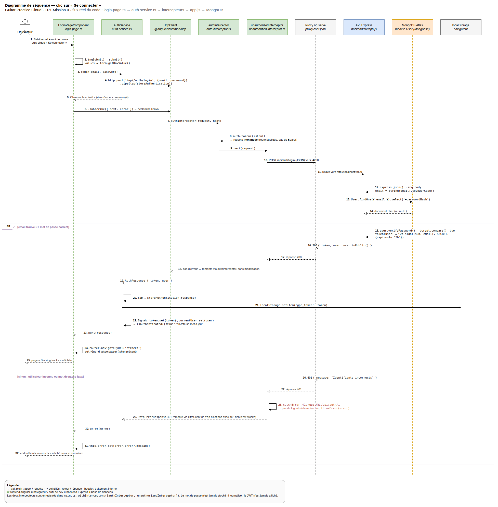

# Mission 0 — Schéma annoté du flux « Se connecter »

Ce document répond à la Mission 0 du `SUJET_ETUDIANT_TP1.md` : cartographier
l'application **sans modifier le code**, puis schématiser ce qui se passe
quand l'utilisateur clique sur « Se connecter ».

## 1. Repérage des responsabilités (`frontend-starter/src`)

| Rôle | Fichier | Ce qu'il fait |
|---|---|---|
| Composant racine | `app/components/app/app.ts` + `.html` | Affiche l'entête, la navigation (`routerLink`) et `<router-outlet />` qui reçoit la page active. |
| Configuration des routes | `app/routes.ts` | Définit les 4 routes (`login`, `register`, `profile`, `tracks`) ; `profile` et `tracks` sont protégées par `canActivate: [authGuard]`. |
| Enregistrement de `HttpClient` | `main.ts` | `provideHttpClient(withInterceptors([authInterceptor, unauthorizedInterceptor]))` — voir Mission 1 pour le second intercepteur. |
| Bootstrap | `main.ts` | `bootstrapApplication(AppComponent, { providers: [provideRouter(routes), provideHttpClient(...)] })`. |
| Modèles | `shared/models/*.model.ts` | Formes TypeScript des réponses API : `User`, `AuthResponse`, `Track`, `Page<T>`. Aucune logique, uniquement des interfaces. |
| Services | `shared/services/auth.service.ts`, `track.service.ts` | Seuls points d'appel à `HttpClient`. Le composant `LoginPageComponent` ne connaît pas l'URL `/api/auth/login`, seulement la méthode `auth.login(email, password)`. |
| Pages | `components/login-page`, `register-page`, `profile-page`, `tracks-page` | Un composant = un dossier avec `.ts` (logique + formulaire réactif), `.html` (template), `.css`. |
| Garde de route | `shared/guards/auth.guard.ts` | `authGuard` bloque l'accès à `/profile` et `/tracks` si `auth.token()` est `null`, et redirige vers `/login`. |
| Ajout du JWT | `shared/interceptors/auth.interceptor.ts` | Intercepteur fonctionnel : lit `auth.token()` (un Signal) et clone la requête sortante avec l'en-tête `Authorization: Bearer <token>` si un token existe. |

## 2. Schéma du flux — clic sur « Se connecter »

```text
┌──────────────────┐      1. submit()        ┌───────────────────┐
│ LoginPageComponent│ ───────────────────────▶│   AuthService      │
│ (login-page.ts)   │  values = form.getRawValue()  (auth.service.ts)  │
└──────────────────┘                          └─────────┬──────────┘
        ▲                                                │ 2. login(email, password)
        │ 6. subscribe({ next, error })                  │    this.http.post('/api/auth/login', {...})
        │                                                ▼
        │                                      ┌───────────────────┐
        │                                      │    HttpClient      │
        │                                      └─────────┬──────────┘
        │                                                │ 3. requête sortante
        │                                                ▼
        │                                      ┌───────────────────┐
        │                                      │ authInterceptor    │  (pas de token encore ⇒ requête inchangée
        │                                      │ (fonctionnel)      │   car /api/auth/login est publique)
        │                                      └─────────┬──────────┘
        │                                                │ 4. proxy.conf.json (dev) → http://localhost:3000
        │                                                ▼
        │                                      ┌───────────────────┐
        │                                      │  API Express       │  POST /api/auth/register|login
        │                                      │  (backend/src/app.js)│  vérifie le mot de passe (bcrypt),
        │                                      └─────────┬──────────┘  signe un JWT (jsonwebtoken, exp 2h)
        │                                                │ 5. { token, user }  ou  401 { message }
        │                                                ▼
        │                                      ┌───────────────────┐
        └──────────────────────────────────────│    AuthService      │
                                                 │ storeAuthentication │  localStorage.setItem('gpc_token', token)
                                                 │                     │  token.set(token)  ← Signal
                                                 │                     │  currentUser.set(user) ← Signal
                                                 └───────────────────┘
```

### Diagramme de séquence UML (draw.io)

Une version plus détaillée de ce flux, sous forme de **diagramme de
séquence** (lignes de vie, messages numérotés, retours en pointillés et
fragment `alt` succès / échec), est fournie dans
[`SCHEMA_FLUX_CONNEXION.drawio`](SCHEMA_FLUX_CONNEXION.drawio).

Pour l'ouvrir : sur <https://app.diagrams.net> (ou draw.io Desktop, ou
l'extension « Draw.io Integration » de VS Code / le plugin « Diagrams.net »
de WebStorm) → *Fichier › Ouvrir depuis › Appareil* et choisir le fichier ;
ou bien *Organiser › Insérer › Avancé › XML…* et coller son contenu.

Aperçu (image exportée du même fichier) :



Étapes annotées :

1. L'utilisateur remplit le `FormGroup` réactif (`email`, `password`) et
   soumet ; `LoginPageComponent.submit()` lit `form.getRawValue()`.
2. Le composant **n'appelle jamais `HttpClient` directement** (règle du
   sujet) : il appelle `AuthService.login(...)`, qui construit la requête
   `POST /api/auth/login`.
3. `HttpClient` transmet la requête à la chaîne d'intercepteurs. Ici,
   `authInterceptor` regarde `auth.token()` : au premier login il n'y a pas
   encore de token, la requête part donc sans en-tête `Authorization`
   (cohérent avec `API_CONTRACT.md` : `/auth/login` est une route publique).
4. En développement, `ng serve --proxy-config proxy.conf.json` redirige
   `/api/*` vers `http://localhost:3000` (backend Express).
5. Le backend vérifie l'email/mot de passe, signe un JWT
   (`jwt.sign({ sub, email }, SECRET, { expiresIn: '2h' })`) et répond soit
   `200 { token, user }`, soit `401 { message: "Identifiants incorrects" }`.
6. Dans `AuthService`, l'opérateur RxJS `tap()` intercepte la réponse
   réussie et appelle `storeAuthentication()` : le token est écrit dans
   `localStorage` (survit à un rechargement de page) **et** dans le Signal
   `token` (réactif : tout ce qui lit `auth.token()` se met à jour), puis
   `currentUser` reçoit les données publiques de l'utilisateur. Le composant
   reçoit la réponse dans son `subscribe({ next, error })` et navigue vers
   `/tracks` en cas de succès, ou affiche `error.error?.message` sinon.

## 3. Routes publiques vs. routes protégées (`API_CONTRACT.md`)

| Route | Authentification requise ? |
|---|---|
| `GET /api/health` | Non |
| `POST /api/auth/register` | Non |
| `POST /api/auth/login` | Non |
| `GET /api/users/me` | Oui (`Authorization: Bearer <token>`) |
| `PUT /api/users/me` | Oui |
| `GET /api/tracks` | Oui |
| `POST /api/tracks` | Oui |
| `GET /api/tracks/:id/audio` | Oui |
| `DELETE /api/tracks/:id` | Oui (bonus) |

C'est exactement ce que `authInterceptor` traduit côté client : il ajoute le
`Bearer` sur **toutes** les requêtes sortantes dès qu'un token existe (il ne
distingue pas les routes), mais comme `/auth/register` et `/auth/login` sont
appelées **avant** qu'un token existe, l'en-tête n'est simplement pas encore
présent au moment de ces deux appels précis.

## 4. Réponses aux questions du sujet

- **Quelles routes du backend sont utilisées par le frontend fourni ?**
  `/api/auth/register`, `/api/auth/login`, `/api/users/me` (GET et PUT),
  `/api/tracks` (GET et POST), `/api/tracks/:id/audio` (GET). `DELETE
  /api/tracks/:id` (bonus) n'est pas encore câblée côté Angular.
- **Où s'effectue « mise à jour du profil utilisateur » ?**
  - Frontend : `profile-page.ts` (méthode `save()`) → `AuthService.update(name)`
    (`auth.service.ts`) → `PUT /api/users/me`.
  - Backend : route `app.put('/api/users/me', auth, ...)` dans
    `backend/src/app.js`, qui met à jour le document `User` dans MongoDB et
    renvoie `user.toPublic()`.
